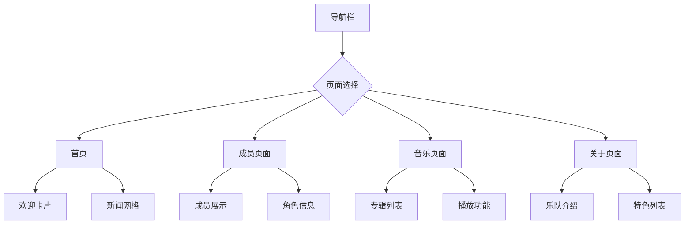

# Ave_Mujica-
想玩建议一整个项目打包，不发演示视频了，对了，自己准备Qt环境，因为太多发不上来。

# Ave Mujica Fan Website

一个基于QML构建的Ave Mujica乐队粉丝网站界面，采用哥特式暗黑美学设计风格。

## 项目概述

这是一个响应式的音乐乐队粉丝网站，展示了Ave Mujica乐队的成员信息、音乐作品和乐队背景。界面设计融合了神秘、优雅的暗黑风格，完美契合乐队的音乐主题。

## 功能特性

### 🎵 核心功能
- **多页面导航**: Home、Members、Music、About四个主要页面
- **响应式布局**: 支持最小1200×800分辨率
- **动态效果**: 星空背景动画、交互式悬停效果
- **自定义字体**: 使用AliceInWonderland字体增强主题氛围

### 🎨 设计特色
- **色彩方案**: 主黑色(#0a0a0a)、古金色(#c0a070)、暗红色(#8b0000)
- **视觉元素**: 
  - 动态星空背景
  - 月亮装饰图标
  - 哥特式按钮设计
- **主题一致性**: 统一的暗黑美学贯穿整个界面

## 界面结构

```
ApplicationWindow
├── 背景层 (星空动画)
├── 主容器
    ├── 顶部导航栏 (Header)
    │   ├── Logo和标题
    │   └── 导航按钮
    ├── 侧边栏 (Sidebar)
    │   ├── 快速导航
    │   └── 社交媒体链接
    └── 主内容区 (ContentArea)
        ├── 月亮装饰
        └── 页面加载器
            ├── 首页 (HomePage)
            ├── 成员页面 (MembersPage)
            ├── 音乐页面 (MusicPage)
            └── 关于页面 (AboutPage)
```

## 技术栈

- **框架**: Qt Quick 6.0+
- **语言**: QML + JavaScript
- **样式**: Material Design风格
- **字体**: 自定义字体支持

## 项目结构

```
assets/
├── fonts/
│   └── AliceInWonderland-1GzL0-2.ttf
└── images/
    ├── logo.png
    ├── members/
    │   ├── amoris.png
    │   ├── mortis.png
    │   ├── timoris.png
    │   ├── oblivionis.png
    │   └── doloris.png
    └── albums/
        ├── worlds_end.png
        ├── mythos.png
        └── eternal_night.png
Main.qml
```

## 界面图解

### 整体布局
```
┌─────────────────────────────────────────────────────────┐
│  🎵 AVE MUJICA       [HOME] [MEMBERS] [MUSIC] [ABOUT]   │
├───────────┬─────────────────────────────────────────────┤
│ QUICK NAV │                                             │
│           │               主内容区域                    │
│ SOCIAL    │                                             │
│ MEDIA     │                  🌙                         │
└───────────┴─────────────────────────────────────────────┘
```

### 页面切换流程


### 组件交互
```
用户操作 → 状态更新 → 界面刷新
   ↓          ↓          ↓
点击按钮 → currentPage → Loader切换
   ↓          ↓          ↓
悬停效果 → hover状态 → 颜色变化
```

## 运行要求

- Qt 6.0或更高版本
- Qt Quick Controls 2
- 支持OpenGL的图形硬件

## 安装和运行

1. 确保安装Qt开发环境
2. 克隆项目到本地
3. 使用Qt Creator打开项目
4. 构建并运行应用程序

## 自定义配置

可以修改以下属性来自定义网站：
- 主题颜色 (primaryColor, secondaryColor等)
- 字体文件路径
- 图片资源路径
- 页面内容数据模型

## 贡献指南

欢迎提交Issue和Pull Request来改进这个项目！

---

*注：本项目为粉丝作品，与Ave Mujica官方无关。所有图片和字体资源需自行准备。*
